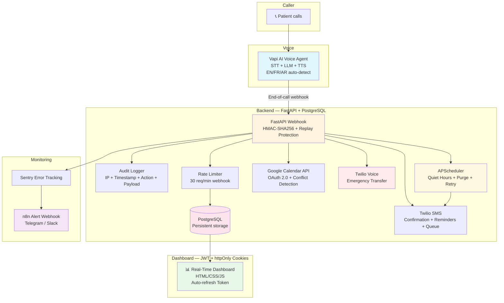

<div align="center">

# 🤖 AI Receptionist Pro

**Freelance AI Voice Agent Toolkit — Enterprise Edition v4.0.0**

[](https://github.com/mailtkarim-bot/AI_Receptionist_Pro)
[](https://python.org)
[](https://fastapi.tiangolo.com)
[](https://postgresql.org)
[](LICENSE)
[](https://render.com)
[](SECURITY.md)
[](https://github.com/mailtkarim-bot/AI_Receptionist_Enterprise_V2.1)

**24/7 Call Answering · Appointment Booking · SMS Confirmation · JWT-Secured Dashboard · Emergency Transfer · GDPR Compliant**

[📐 Architecture](#-architecture) · [🚀 Quick Start](#-quick-start) · [💰 Business Model](#-business-model) · [🔐 Security](#-security) · [📞 Contact](#-contact)

</div>

---

## TL;DR

AI voice receptionist for clinics and SMEs. **FastAPI** backend + **PostgreSQL** persistence + **Vapi** voice AI + **Twilio** SMS/Voice + **Google Calendar** sync + **JWT-secured dashboard** with **httpOnly cookies**.

Sold as a **$2,500 one-time freelance setup** (not SaaS). Client pays Vapi/Twilio consumption directly. Zero recurring platform fees.

**Built for Dubai & GCC markets** — multilingual EN/FR/AR, timezone-aware, VARA-aligned data practices, GDPR Right to Erasure, quiet-hours SMS, calendar conflict detection, and emergency call transfer.

> 🆕 **v4.0.0 Enterprise**: GDPR erase endpoint, quiet-hours SMS queue, calendar conflict detection, emergency Twilio voice transfer, refresh token rotation, automatic data purge, security headers, HMAC webhook replay protection, and SHA-256 PII hashing with zero plaintext persistence.

---

## 🎯 Why I Built This

Running a solo clinic in Dubai? Your receptionist clocks out at 6 PM. Your patients call at 8 PM. Those calls go to voicemail — and **60% never call back**.

This toolkit lets a **freelance developer** deploy a production-grade AI receptionist for any clinic in **under 48 hours**:
- AI answers in natural voice (Arabic, English, French)
- Books directly into the doctor's Google Calendar — **with conflict detection**
- Sends SMS confirmation instantly — **or queues for quiet hours**
- **Transfers emergencies** to the doctor's mobile via Twilio Voice
- **Secure dashboard** shows every call, every booking, every recovered patient — **login required with rotating refresh tokens**
- **One-click GDPR erasure** — anonymize any patient on request

**One setup. $2,500. Client owns their infrastructure.**

---

## 📐 Architecture



---

## 🚀 What's New in v4.0.0 Enterprise

| Feature | v3.0 (Previous) | v4.0 Enterprise (Now) |
|---------|-----------------|------------------------|
| **GDPR Right to Erasure** | Mentioned only | **`DELETE /patients/{phone_hash}`** — anonymizes all records instantly |
| **Quiet Hours SMS** | Sent immediately 24/7 | **Queued 21h–08h**, delivered at 08h00 via APScheduler |
| **Calendar Conflict Detection** | Blind insert | **`check_conflict()`** prevents double-booking before insert |
| **Emergency Transfer** | Flag stored only | **Twilio Voice `<Dial>`** + SMS alert to doctor |
| **Refresh Token Rotation** | 60-min expiry, no refresh | **7-day rotating refresh tokens** in DB, auto-refresh dashboard |
| **Automatic Data Purge** | None | **Daily cron** — calls 2y, audit 1y, SMS queue 30d, revoked tokens |
| **Security Headers** | None | **HSTS + CSP + X-Frame-Options + X-Content-Type-Options** |
| **Webhook Replay Protection** | None | **Timestamp window 5min + idempotence by `call_id`** |
| **PII Storage** | Phone plaintext in DB | **SHA-256 hashed ONLY** — zero plaintext persistence |
| **Health Check** | Hardcoded "connected" | **Real DB `SELECT 1`** — returns 503 if PostgreSQL down |
| **Cookie Security** | localStorage token | **httpOnly + Secure + SameSite=Strict** cookies |
| **Input Validation** | Raw dict | **Pydantic `VapiWebhookPayload`** validation on every webhook |
| **CORS** | Wildcard `*` fallback | **Strict origin whitelist** — no fallback |
| **Password Security** | Hardcoded fallback | **Zero fallback** — crash at startup if missing |
| **Deployment** | Uvicorn single worker | **Gunicorn + 2 Uvicorn workers** — production-ready |

---

## ✨ What the Client Gets

### For the Clinic Owner
| Feature | Benefit |
|---------|---------|
| **24/7 call answering** | Zero missed calls after hours, weekends, holidays |
| **Auto-booking** | Appointments land directly in doctor's Google Calendar |
| **Calendar conflict guard** | No double-booking — AI checks availability first |
| **SMS confirmation** | Patient receives instant text; quiet hours queued for morning |
| **Emergency transfer** | Urgent calls forwarded to doctor's mobile **instantly via voice** |
| **Real-time dashboard** | See all calls, bookings, missed calls, transcripts — **secure login** |
| **Multilingual** | English, French, Arabic — auto-detected |
| **No lock-in** | Client owns their Vapi/Twilio accounts. Stop anytime. |
| **GDPR ready** | One-click patient data anonymization on request |

### For the Developer (You)
| Feature | Benefit |
|---------|---------|
| **PostgreSQL Persistence** | Data survives server restarts. Real database. |
| **JWT + Refresh Token Rotation** | Dashboard protected with 7-day sessions. No re-login hell. |
| **Alembic Migrations** | Schema changes are versioned and reversible. |
| **Structured Logging** | JSON logs with `structlog` — parseable by any SIEM. |
| **Rate Limiting** | Anti-bot protection on webhooks. |
| **Audit Logging** | Every webhook, every calendar sync, every SMS — logged with IP. |
| **Sentry Integration** | Production errors captured instantly. |
| **HMAC Webhook Verification** | Every Vapi request cryptographically signed. |
| **Security Headers** | HSTS, CSP, X-Frame-Options — OWASP-compliant. |
| **Auto-Purge** | Database never bloats. Compliance retention enforced. |

---

## 💰 Business Model — Freelance Setup (Not SaaS)

This is a **one-time deployment service**, not a monthly subscription.

| Item | Who Pays | Amount |
|------|----------|--------|
| **Your setup fee** | Client → You | **$2,500 one-time** |
| Vapi (voice AI) | Client → Vapi.ai | ~$0.05/minute |
| Twilio (number + SMS + Voice) | Client → Twilio | ~$1/mo number + $0.01-0.05/SMS + voice calls |
| Render (hosting) | You or Client | $7-12/mo (Starter + PostgreSQL) |
| Google Calendar | Client → Google | Free (quota limits) |
| GitHub Pages (dashboard) | Free | $0 |

> **Why this model?** You sell expertise and configuration. The client pays their own consumption. No SaaS overhead, no support tickets at 2 AM, no billing complexity. You deliver, train, and move to the next client.

---

## 🔐 Security & Compliance

### Security Layers

| Layer | Implementation |
|-------|----------------|
| **Webhook Verification** | HMAC-SHA256 signature + 5-min timestamp window + `call_id` idempotence |
| **Authentication** | JWT access token (15 min) + rotating refresh token (7 days) in httpOnly cookies |
| **Rate Limiting** | `slowapi` — 30 req/min webhook, 100 req/min API, 10 req/min login |
| **Database** | SQLAlchemy ORM — parameterized queries (SQL injection proof) |
| **PII Handling** | Phone numbers **SHA-256 hashed** in DB; **plaintext NEVER persisted**; SMS queue purged in 30d |
| **Secrets** | Environment variables only — **zero fallback values**; crash at startup if missing |
| **HTTPS** | SSL/TLS on all endpoints (Render) + HSTS header |
| **Audit Trail** | Every action logged with source IP, timestamp, success/failure, payload summary |
| **Security Headers** | `X-Content-Type-Options: nosniff`, `X-Frame-Options: DENY`, `CSP: default-src 'self'` |
| **Emergency Isolation** | Emergency logic isolated; voice transfer via Twilio `<Dial>` |

### Compliance

| Standard | Status |
|----------|--------|
| **Dubai VARA** | Data minimization, TLS 1.3, hashed PII, retention policy, audit trail |
| **GDPR** | **Right to erasure endpoint** (`/patients/{phone_hash}`), data minimization, hashed PII, 2-year retention |
| **HIPAA-ready** | *Requires third-party audit before PHI handling* |
| **OWASP Top 10** | Mitigated: Injection, Broken Auth, Sensitive Data Exposure, Security Misconfiguration, Insufficient Logging |

> **Disclaimer:** This project is provided for professional portfolio and educational purposes. A **third-party security audit is mandatory** before production deployment in healthcare or regulated environments. The author is not liable for misuse or deployment without proper review. All code includes prominent warnings that projects are educational and require professional audit before real deployment.

---

## 🚀 Quick Start

### Prerequisites
- Python 3.12+
- PostgreSQL 15+ (local or cloud)
- Vapi account ([vapi.ai](https://vapi.ai))
- Twilio account ([twilio.com](https://twilio.com)) with Voice + SMS enabled
- Google Cloud project (Calendar API enabled)
- Render account ([render.com](https://render.com))

### 1. Clone & Install
```bash
git clone https://github.com/mailtkarim-bot/AI_Receptionist_Pro.git
cd AI_Receptionist_Pro
python -m venv venv
source venv/bin/activate
pip install -r requirements.txt
```

### 2. Configure
```bash
cp .env.example .env
# Edit .env with STRONG credentials — NO FALLBACKS exist in code
# Generate SECRET_KEY: openssl rand -hex 32
# Generate ADMIN_PASSWORD: openssl rand -base64 24
```

### 3. Initialize Database
```bash
# Create local PostgreSQL database
createdb ai_receptionist

# Generate migration for new tables (SMSQueue, RefreshToken)
alembic revision --autogenerate -m "v4_add_sms_queue_refresh_tokens"

# Run migrations
alembic upgrade head
```

### 4. Run Locally
```bash
uvicorn backend.main:app --reload --port 8000
```

### 5. Test Webhook
```bash
# Generate HMAC signature
SECRET="your_vapi_webhook_secret"
BODY='{"call":{"id":"test-001","customer":{"number":"+97150XXXXXXX"}},"status":"completed","analysis":{"booked_appointment":{"date":"2026-06-20","time":"14:00","duration_minutes":30,"service":"checkup"}}}'
SIG=$(echo -n "$BODY" | openssl dgst -sha256 -hmac "$SECRET" | sed 's/^.* //')

curl -X POST http://localhost:8000/vapi-webhook   -H "Content-Type: application/json"   -H "X-Vapi-Signature: $SIG"   -d "$BODY"
```

### 6. Test GDPR Erase
```bash
# Login first
curl -X POST http://localhost:8000/token   -d "username=admin&password=$ADMIN_PASSWORD"   -c cookies.txt

# Erase patient (replace with actual SHA-256 hash)
PHONE_HASH=$(echo -n "+97150XXXXXXX" | sha256sum | awk '{print $1}')
curl -X DELETE "http://localhost:8000/patients/$PHONE_HASH"   -b cookies.txt
```

### 7. Deploy to Render
[](https://render.com/deploy)

---

## 📁 Project Structure

```
AI_Receptionist_Pro/
├── 📄 README.md                 # This file
├── 📄 COMPLIANCE.md             # VARA/GDPR/HIPAA alignment
├── 📄 CLIENT_SETUP.md           # Post-delivery handover guide
├── 📄 LICENSE                   # MIT License
├── 📄 .env.example              # Environment template (NO secrets, NO fallbacks)
├── 📄 alembic.ini               # Database migration config
├── 📄 requirements.txt           # Pinned dependencies (psycopg2, gunicorn, apscheduler)
├── 📄 render.yaml               # Render.com deployment blueprint (gunicorn workers)
│
├── 🐍 backend/                  # FastAPI Enterprise Application
│   ├── __init__.py
│   ├── main.py                   # Webhook + API + Auth + Health + GDPR Erase + Refresh
│   ├── database.py               # SQLAlchemy engine & session
│   ├── models_db.py              # PostgreSQL ORM (CallRecord, AppointmentRecord, AuditLog, SMSQueue, RefreshToken)
│   ├── config.py                 # Settings & strict validation (zero fallback)
│   ├── security.py               # HMAC + replay protection + body size limit
│   ├── calendar_sync.py          # Google Calendar OAuth + conflict detection
│   ├── sms_sender.py             # Twilio SMS service + E.164 validation + masked logs
│   ├── scheduler.py              # APScheduler: purge + quiet hours + retry
│   └── models.py                 # Pydantic schemas (validation + EraseRequest)
│
├── 🗣️ alembic/                   # Database Migrations
│   ├── env.py                    # Alembic environment
│   ├── script.py.mako            # Migration template
│   └── versions/                 # Auto-generated migrations
│
├── 🎨 dashboard/                  # JWT-Secured Client Dashboard
│   ├── index.html                # Auth wall + analytics UI
│   ├── app.js                    # API client with httpOnly cookies + auto-refresh
│   └── style.css                 # Responsive dark theme
│
├── 🗣️ vapi_config/                # AI Voice Configuration
│   ├── prompt_system.txt         # System prompt (EN/FR/AR + emergency detection)
│   └── functions.json            # Vapi function definitions
│
├── 🧪 tests/                      # Enterprise Test Suite
│   ├── __init__.py
│   ├── test_e2e.py               # End-to-end: login → webhook → DB → erase
│   ├── test_webhook.py           # Auth, HMAC, idempotence, emergency
│   ├── test_security.py          # Rate limiting, replay, body size, tampering
│   ├── test_calendar.py          # Calendar sync + conflict detection mocks
│   ├── test_sms.py               # SMS sender + E.164 validation mocks
│   └── test_scheduler.py         # Purge + SMS queue + refresh token cleanup
│
├── 📚 docs/                       # Technical Documentation
│   └── ARCHITECTURE.md           # Detailed system design + v4 security additions
│
└── 🔧 .github/
    └── workflows/
        └── ci.yml                # Lint + test + PostgreSQL + coverage + pip-audit
```

---

## 🧪 Testing

```bash
# Run full test suite with PostgreSQL
pytest tests/ -v --cov=backend --cov-report=html

# Run specific module
pytest tests/test_e2e.py -v

# Run with coverage threshold (fails under 85%)
pytest tests/ --cov=backend --cov-report=term-missing --cov-fail-under=85
```

---

## 📦 Tech Stack

| Layer | Technology |
|-------|------------|
| **Backend** | FastAPI + Uvicorn + Pydantic v2 + Gunicorn |
| **Database** | PostgreSQL + SQLAlchemy ORM + Alembic |
| **Auth** | JWT (python-jose) + bcrypt (passlib) + rotating refresh tokens |
| **Rate Limiting** | slowapi |
| **Scheduling** | APScheduler (quiet hours, purge, retry) |
| **Logging** | structlog (JSON) |
| **Monitoring** | Sentry SDK |
| **Voice AI** | Vapi.ai (STT/LLM/TTS) |
| **Calendar** | Google Calendar API (OAuth 2.0) |
| **SMS** | Twilio Programmable Messaging |
| **Voice** | Twilio Programmable Voice (emergency transfer) |
| **Dashboard** | Vanilla HTML/CSS/JS (zero dependencies) |
| **CI/CD** | GitHub Actions + pytest + PostgreSQL service + pip-audit |
| **Hosting** | Render (backend) + GitHub Pages (dashboard) |

---

## 🗺️ Roadmap

| Quarter | Milestone |
|---------|-----------|
| **Q2 2026** | ✅ v4.0.0: GDPR erase, quiet hours, conflict detection, emergency transfer, refresh tokens, auto-purge, security headers |
| **Q3 2026** | WhatsApp Business integration, n8n automation workflows |
| **Q3 2026** | Multi-tenancy (one backend, multiple clinics) |
| **Q4 2026** | CRM connectors (HubSpot, Salesforce, Zoho) |
| **Q4 2026** | Voice cloning for branded clinic voices |
| **Q1 2027** | Analytics dashboard with revenue recovery metrics |
| **Q2 2027** | AWS KMS integration for end-to-end PII encryption |

---

## 🏢 Need Something Bigger?

This toolkit is perfect for **solo clinics and small businesses** who want to own their infrastructure.

If you're a **chain of clinics, a franchise, or a corporate group** looking for:
- Multi-tenant SaaS platform
- 3-tier subscription management (Basic / Pro / Enterprise)
- WhatsApp, Email, and Web3 USDC payments
- Redis-backed security, Docker orchestration, React dashboard
- White-label solution with your own branding

**→ Check out [AI Receptionist Enterprise](https://github.com/mailtkarim-bot/AI_Receptionist_Enterprise_V2.1)**  
The same voice AI power, engineered for scale.

---

## 🤝 Contributing

This is a professional portfolio project. Forks, issues, and feedback are welcome.

**Commit convention:**
- `feat:` — New feature
- `fix:` — Bug fix
- `sec:` — Security improvement
- `docs:` — Documentation
- `test:` — Tests
- `chore:` — Maintenance

---

## 📞 Contact

Interested in a custom AI Receptionist for your clinic or business?

| | |
|---|---|
| **Developer** | Steh Rayan — AI Voice Agent & Automation Engineer |
| **GitHub** | [@mailtkarim-bot](https://github.com/mailtkarim-bot) |
| **Markets** | Dubai, UAE & GCC · Remote worldwide |
| **Availability** | Sun–Thu, 9 AM–6 PM GST |

**For freelance inquiries:** $2,500 setup + $100/hour for custom modifications.

---

## 📜 License

Licensed under the [MIT License](LICENSE).

> **Important:** This project is provided as-is for educational and professional portfolio purposes. It requires a **third-party security audit** before production deployment in healthcare or regulated environments. The author is not liable for misuse or deployment without proper review. All code includes prominent warnings that projects are educational and require professional audit before real deployment.

---

<div align="center">

**Built with ❤️ in Dubai**  
*"Never miss a call. Never lose a patient. Never compromise on security."*

</div>
